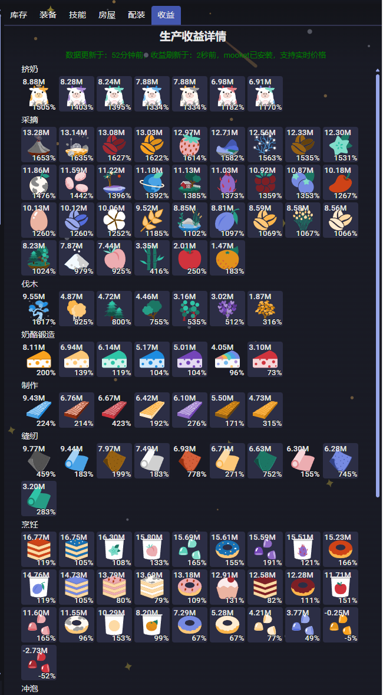
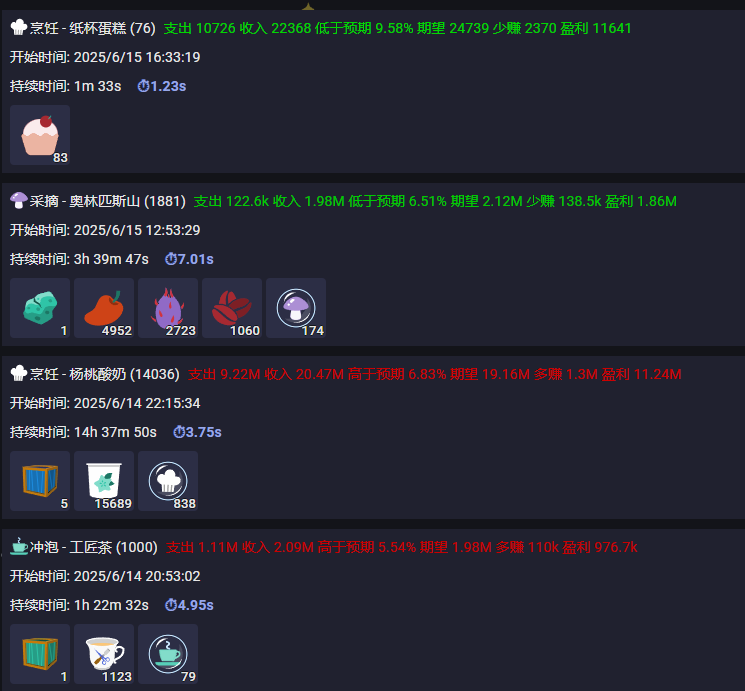

# MWI Profit Panel - MilkyWayIdle收益面板插件

## 项目描述

这是一个MilkyWayIdle游戏的插件，在游戏右面板添加了根据当前市场数据计算出来的收益详情功能：

1. 收益计算包括社区buff、稀有和精华产出的收益
2. 收益采用左买右卖计算 - 暂时不可修改
3. Tooltip显示详细的价格和buff等数据。价格后面括号中表示**最新价格**和**近一天平均价格**的差异
4. 掉落记录增加更详细的掉落详情
5. 安装了**mooket**插件之后：
   - 点击图标会跳转到动作的制造弹窗
   - 浏览市场价格或者在mooket中置顶的价格的更新会被实时更新到收益面板

## 注意事项

- **如果之前有安装过带这个功能的MWITools，则需要将MWITools更新为正式版，防止和这个插件冲突**
- **可选依赖：[mooket](https://greasyfork.org/zh-CN/scripts/530316-mooket)**，安装后可以跳转到动作

## 开发方式

项目使用Rollup打包工具构建，主要配置如下：

- 开发模式：`npm run dev` (同时启动Rollup监听和HTTP服务器)
- 生产构建：`npm run build`
- 预览：`npm run preview`

主要技术栈：
- Rollup + Babel转译
- 支持开发环境热更新
- 输出为Tampermonkey用户脚本格式

## 更新路线

1. 利润计算方式：A买B卖

**没有快速迭代计划，只会在未来几周找个时间进行更新。如果有建议在反馈中提出**

## 历史更新

- 06/17 大更新 - 详细的掉落记录数据分析
  1. 增加三制造的基础产物利润数据
  1. 增加加工茶的支持，三采预期利润有所上升
  1. 完善装备和房子buff的计算，整体预期利润略微上升
  1. 增加利润率显示，避开低利润率防止亏本
- 05/25.ver2 修复未安装mooket情况下出现错误导致插件不可用
- 05/25 修改跳转到动作为∞次，防止误操作
- 05/24 添加点击图标跳转到对应动作，优化Tooltip数据展示，集成mooket实时数据
- 05/22 修正社区buff的读取，以及显示社区采集buff